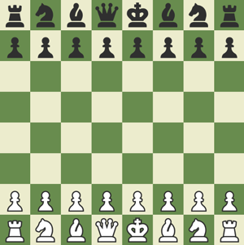
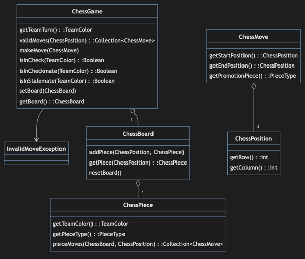

# ♕ Phase 0: Chess Moves

- [Chess Application Overview](../chess.md)
- [Getting Started](getting-started.md)
- [Starter Code](starter-code)

- 🖥️ [Design Principles (Chess Examples)](https://docs.google.com/presentation/d/1dncxSAgnIqjV9RNzGR94EWVltJiCApqC3EvNPqz97-E/edit?usp=sharing)

In this part of the Chess Project, you will implement a basic representation of the game of chess. This includes the setting up of the board and defining how pieces move.

## The Game of Chess

Chess is a strategy game where 2 players take turn moving pieces and capturing enemy pieces with the goal of trapping the enemy king. Each of the 6 types of pieces has a unique way of moving/capturing. A piece captures an enemy piece when moving to the enemy piece’s location, after which the enemy piece is removed from the game. You win when your opponent has no way to avoid you being able to capture their king.

### Movement

**`King`**

Kings may move 1 square in any direction (including diagonal) to either a position occupied by an enemy piece (capturing the enemy piece), or to an unoccupied position. A player is not allowed to make any move that would allow the opponent to capture their King. If your King is in danger of being captured on your turn, you must make a move that removes your King from immediate danger.

**`Pawn`**

Pawns normally may move forward one square if that square is unoccupied, though if it is the first time that pawn is being moved, it may be moved forward 2 squares (provided both squares are unoccupied).
Pawns cannot capture forward, but instead capture forward diagonally (1 square forward and 1 square sideways). They may only move diagonally like this if capturing an enemy piece.
When a pawn moves to the end of the board (row 8 for white and row 1 for black), they get promoted and are replaced with the players choice of Rook, Knight, Bishop, or Queen (they cannot stay a Pawn or become King).

**`Rook`**

Rooks may move in straight lines as far as there is open space. If there is an enemy piece at the end of the line, rooks may move to that position and capture the enemy piece.

**`Knight`**

Knights move in an `L` shape, moving 2 squares in one direction and 1 square in the other direction. Knights are the only piece that can ignore pieces in the in-between squares (they can "jump" over other pieces). They can move to squares occupied by an enemy piece and capture the enemy piece, or to unoccupied squares.

**`Bishop`**

Bishops move in diagonal lines as far as there is open space. If there is an enemy piece at the end of the diagonal, the bishop may move to that position and capture the enemy piece.

**`Queen`**

Queens are the most powerful piece and may move in straight lines and diagonals as far as there is open space. If there is an enemy piece at the end of the line, they may move to that position and capture the enemy piece. (In simpler terms, Queens can take all moves a Rook or Bishop could take from the Queens position).

### Board Setup

Each player starts with 8 pawns, 1 King, 1 Queen, 2 Bishops, 2 Knight, and 2 Rooks. This gives you a total of 16 pieces per player. White’s pawns span row 2, while Black’s pawns span row 7. The rest of the pieces are lined up across row 1 for white and row 8 for black in the following columns: 1: Rook, 2: Knight, 3: Bishop, 4: Queen, 5: King, 6: Bishop, 7: Knight, 8: Rook. A black square should always be the square in the bottom left side of the board.

Below is the setup using the first letter to denote each piece (using `n` for knight). Capital letters represent white pieces and lowercase letters represent black pieces.

```sh
|r|n|b|q|k|b|n|r|
|p|p|p|p|p|p|p|p|
| | | | | | | | |
| | | | | | | | |
| | | | | | | | |
| | | | | | | | |
|P|P|P|P|P|P|P|P|
|R|N|B|Q|K|B|N|R|
```

Here is what the board would look like graphically.



Here are some guides that may help you learn the rules of chess:

- [https://www.chess.com/
  learn-how-to-play-chess](https://www.chess.com/learn-how-to-play-chess)
- [https://en.wikipedia.org/wiki/Rules_of_chess](https://en.wikipedia.org/wiki/Rules_of_chess)

## Starter Code

To begin building your chess application, you must first following the instructions in the [Getting Started Document](getting-started.md).

This provides you with an IntelliJ project that contains the following three modules.

1. **Client** - The command line program that players use to create and play a game of chess. This communicates with your server over the network in order to play a game.
1. **Server** - A program that handles network requests to create and play games. It stores games persistently in a database and sends out notifications to all the players of a game.
1. **Shared** - A code library that contains the rules and representation of a chess game that both the `client` and `server` use to exercise and validate game play.

In this phase you will implement the shared code that defines the board, pieces, and the rules of chess. In later phases you will use the code you create to create a fully playable game.

The starter code contains defines the classes defined by the following diagram. However, instead of a full implementation, the methods all simply throw an exception if invoked. The classes are found in the `shared/src/main/java/chess` directory.



**⚠ NOTE**: You are not limited to this representation. However, you must not change the existing class names or method signatures since they are used by the pass off tests. You will likely need to add new classes and methods to complete the work required by this phase.

## Chess Classes

### ChessGame

This class serves as the top-level management of the Chess Game. It is responsible for executing moves as well as reporting the game status.

You will not need to implement any code in this class for this phase.

#### Key Methods

- **validMoves**: Takes as input a position on the chessboard and returns all moves the piece there can legally make. If there is no piece at that location, this method returns `null`.
- **makeMove**: Receives a given move and executes it, provided it is a legal move. If the move is illegal, it throws a `InvalidMoveException`. A move is illegal if the chess piece cannot move there, if the move leaves the team’s king in danger, or if it’s not the corresponding teams turn.
- **isInCheck**: Returns true if the specified team’s King could be captured by an opposing piece.
- **isInCheckmate**: Returns true if the given team has no way to protect their king from being captured.
- **isInStalemate**: Returns true if the given team has no legal moves and it is currently that team’s turn.

### ChessBoard

This class stores all the uncaptured pieces in a Game. It needs to support adding and removing pieces for testing, as well as a `resetBoard()` method that sets the standard Chess starting configuration.

### ChessPiece

This class represents a single chess piece, with its corresponding type and team color. It contains the `PieceType` enumeration that defines the different types of pieces.

```java
public enum PieceType {
    KING,
    QUEEN,
    BISHOP,
    KNIGHT,
    ROOK,
    PAWN
}
```

#### Key Methods

- **pieceMoves**: This method is similar to `ChessGame::validMoves`, except it does not check the turn or Check (king safety) constraints. This method does account for enemy and friendly pieces blocking movement paths. Each of the 6 different implementations of this class will need a unique pieceMoves method to calculate valid moves for that type of piece. See later in the specs for rules on how each piece moves, as well as a couple special moves that can be implemented for extra credit.

### ChessMove

This class represents a possible move a chess piece could make. It contains the starting and ending positions. It also contains a field for the type of piece a pawn is being promoted to. If the move would not result in a pawn being promoted, the promotion type field should be null.

### ChessPosition

This represents a location on the chessboard. This should be represented as a row number from 1-8, and a column number from 1-8. (1,1) corresponds to the bottom left corner (which in chess notation is denoted `a1`). (8,8) corresponds to the top right corner (`h8` in chess notation).

## Testing

The test cases in `passoffTests → chessTests.ChessPieceTests` has a collection of tests for the movement of individual pieces.

To run the tests, you can click the play icon next to an individual test, or you can right click on a package or class and select `Debug` or `Debug Tests in …`


## Recommended Order

For this project, you are free to implement the classes described above in whatever order makes sense to you. However, it is suggested that you follow the principles of test driven development.

- Execute the `BishopMoveTests.bishopMoveUntilEdge` test.
- Observe what code is throwing a `Not implemented` exception.
- Replace the code that is throwing the exception with something reasonable.
- Rerun the test, debug, and continue implementing until the test passes.
- Commit your changes to GitHub.
- Repeat the above process for each of the other tests.

## Object Overrides

In order for the tests to pass, you are required to override the `equals()` and `hashCode()` methods in your ChessMove implementation and your ChessPosition implementation. To do this automatically in IntelliJ, select Code > Generate... > equals() and hashCode(). The default methods provided by IntelliJ should suffice. The `equals()` and `hashCode()` methods need to be more than merely a call to `super()`, and using 'Generate...' should do this correctly. Note, you must have already have finished implementing these classes before IntelliJ will be able to generate these methods.

⚠ NOTE: Although not required, debugging is often easier if you override the `toString()` method and return a concise representation of the object.

### Pass Off Tests

The `shared/src/test/java/passoffTests` directory contains unit tests that you will use to drive your development efforts. Once all the tests run successfully you are done with this phase.

## Pass Off and Grading

To pass off this assignment, meet with a TA and demonstrate that your code passes the provided test cases.

### Grading Rubric

| Category      | Criteria                        | Points |
| ------------- | ------------------------------- | -----: |
| Functionality | All pass off test cases succeed |    125 |
|               | Total                           |    125 |
