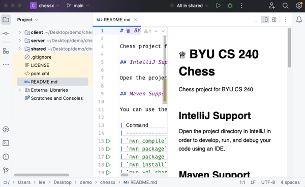

# Chess Game - Getting Started

📁 [Starter code](starter-code)

Take the following steps to set up your Chess project. Make sure you have already completed the deliverable for creating your [Chess GitHub Repository](../chess-github-repository/chess-github-repository.md).

## Adding the Template Chess Project

1. Unzip the [starter-code/chess.zip](starter-code/chess.zip) file to the directory where you cloned the Chess GitHub Repository.

   ```sh
   unzip <class-repo-dir>/chess/0-chess-moves/starter-code/chess.zip
   ```

   ⚠ Note: `unzip` does not exist on Windows. You will need to unzip the file using a different utility or by extracting it in the Windows File Explorer. However, if you use the Windows File Explorer it will create an additional `chess` directory. Make sure you move the files out of the extra `chess` directory and then delete the extra `chess` directory before you proceed.

   With the chess starter code unzipped your chess repository top level directory structure should look like the following:

   ```
   chess
   ├── .idea
   ├── .git
   ├── client
   ├── server
   └── shared
   ```

1. Commit and push the changes to GitHub
   ```sh
   git add .
   git commit -am "init(phase0)"
   git push
   ```

## Open With IntelliJ

Open the project directory in IntelliJ start developing, running, and debugging your code using an IDE.



If you get a prompt asking you to build with Maven, then make sure you skip that action.


