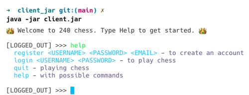
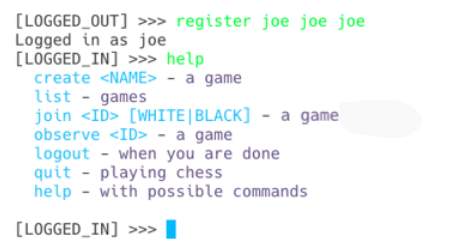
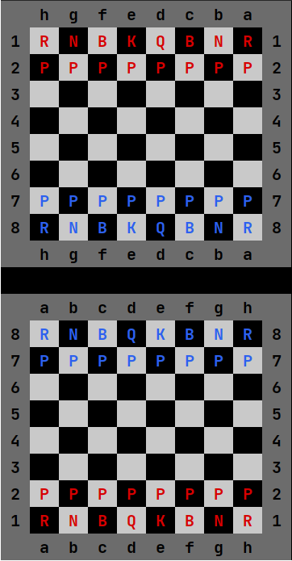

## ♕ Phase 5: Chess Pregame

- [Chess Application Overview](../chess.md)
- [Getting Started](getting-started.md)
- [Starter Code](starter-code)

In this part of the Chess Project, you will create an initial version of your Chess client. Your Chess client will be a terminal-based (i.e., console-based) program that gives the user a simple interface for playing Chess. Your client should implement all user interactions that occur outside of actually playing a game. Game play interactions will be implemented in the next phase. This includes allowing the user to display help text, register, login, list existing games, create a new game, join a game, observe a game, logout, and exit. You will also write the client code that draws the chessboard.

To implement this, you will create a ServerFacade class to handle sending and recieving HTTP requests to and from your server. Your client code will then use your ServerFacade methods to make server API calls.

## Required Functionality

### Prelogin UI

When the user first opens your Chess client application they can execute any of the Prelogin commands.

| Command      | Description                                                                                                                                                                                                      |
| ------------ | ---------------------------------------------------------------------------------------------------------------------------------------------------------------------------------------------------------------- |
| **Help**     | Displays text informing the user what actions they can take.                                                                                                                                                     |
| **Quit**     | Exits the program.                                                                                                                                                                                               |
| **Login**    | Prompts the user to input login information. Calls the server login API to login the user. When successfully logged in, the client should transition to the Postlogin UI.                                        |
| **Register** | Prompts the user to input registration information. Calls the server register API to register and login the user. If successfully registered, the client should be logged in and transition to the Postlogin UI. |

#### Example Prelogin UI



### Postlogin UI

After the user has registered or logged in they can then execute any of the Postlogin commands.

| Command           | Description                                                                                                                                                                                                                                                                                                                          |
| ----------------- | ------------------------------------------------------------------------------------------------------------------------------------------------------------------------------------------------------------------------------------------------------------------------------------------------------------------------------------ |
| **Help**          | Displays text informing the user what actions they can take.                                                                                                                                                                                                                                                                         |
| **Logout**        | Logs out the user. Calls the server logout API to logout the user. After logging out with the server, the client should transition to the Prelogin UI.                                                                                                                                                                               |
| **Create Game**   | Allows the user to input a name for the new game. Calls the server create API to create the game. This does not join the player to the created game; it only creates the new game in the server.                                                                                                                                     |
| **List Games**    | Lists all the games that currently exist on the server. Calls the server list API to get all the game data, and displays the games in a numbered list, including the game name and players (not observers) in the game. The numbering for the list should be independent of the game IDs.                                            |
| **Join Game**     | Allows the user to specify which game they want to join and what color they want to play. They should be able to enter the number of the desired game. Your client will need to keep track of which number corresponds to which game from the last time it listed the games. Calls the server join API to join the user to the game. |
| **Join Observer** | Allows the user to specify which game they want to observe. They should be able to enter the number of the desired game. Your client will need to keep track of which number corresponds to which game from the last time it listed the games. Calls the server join API to verify that the specified game exists.                   |

#### Example Postlogin UI



### Gameplay UI

As stated previously, gameplay will not be implemented until later. For now, when a user joins or observes a game, the client should draw the initial state of a Chess game in the terminal, but not actually enter gameplay mode. The chessboard should be drawn twice, once in each orientation (i.e., once with white pieces at the bottom and once with black pieces at the bottom). An example of what the chessboard might look like is given below. You are free to make your chessboard look different as long as the essential information is displayed in an easily readable way.



### Relevant Instruction Topics

- [Console UI](../../instruction/console-ui/console-ui.md): Reading from the keyboard and writing out fancy text.
- [Web API](../../instruction/web-api/web-api.md#web-client): Making HTTP client requests.

### Tips for using Unicode chess characters

Should you choose to use the unicode Chess characters, some machines by default don't render them in the console (this is often the case if you are using a .jar file). To fix this on Windows (it shouldn't be an issue on Mac/Linux), go to Settings > Time and Language > Language and Region > Administrative Language Settings and on the Administrative tab click Change System Locale and then check the box for using UTF-8 which requires system reboot. This should fix the issue.

Additionally, you may notice that the chess characters might render slightly wider than everything else. To balance this out, a wider version of a space called an em-space can be used. It is denoted by \u2003 and is currently being used as the middle space in the `EMPTY` escape sequence, so if you choose not to use the Unicode chess pieces, you will have to replace that with a regular space to get everything to line up vertically.

## ☑ Deliverable

### Pass Off Tests

There are no new pass off test cases for this assignment.

### Unit Tests

Write positive and negative unit tests for each method on your ServerFacade class (all the methods used to call your server).

Your tests must be located in the class provided starter code in the file `client/src/test/java/clientTests/ServerFacadeTests.java`

⚠ `ServerFacadeTests.java` contains code that will automatically start and shutdown your server on a randomly assigned port as part of the test. However, you will still need to start your server when you manually run your client.

```java
public class ServerFacadeTests {

    private static Server server;

    @BeforeAll
    public static void init() {
        server = new Server();
        var port = server.run(0);
        System.out.println("Started test HTTP server on " + port);
    }

    @AfterAll
    static void stopServer() {
        server.stop();
    }


    @Test
    public void sampleTest() {
        Assertions.assertTrue(true);
    }
}
```

Replace the `sampleTest` method with your own unit tests.

Your server facade will need to take the port that the server is running on as part of its initialization when running your tests. You can accomplish this by modifying the `init` method to create and initialize your server facade with code that is something like the following:

```java
private static Server server;
static ServerFacade facade;

@BeforeAll
public static void init() {
    server = new Server();
    var port = server.run(0);
    System.out.println("Started test HTTP server on " + port);
    facade = new ServerFacade(port);
}
```

You can then directly test your facade with tests such as demonstrated in the following `register` unit test example.

```java
@Test
void register() throws Exception {
    var authData = facade.register("player1", "password", "p1@email.com");
    assertTrue(authData.authToken().length() > 10);
}
```

Make sure you clear your database between each test. You can do this in a method that has the `@BeforeEach` annotation.

### Pass Off, Submission, and Grading

All of the tests in your project must succeed in order to complete this phase.

To pass off this assignment submit your work to the course [auto-grading](https://cs240.click/) tool. When that is done, meet with a TA and demonstrate that your Chess client and server meet all requirements and assign you a final grade.

### Grading Rubric

**⚠ NOTE**: You are required to commit to GitHub with every minor milestone. For example, after you successfully pass a test. This should result in a commit history that clearly details your work on this phase. If your Git history does not demonstrate your efforts then your submission may be rejected.

| Category       | Criteria                                                                                                                                                                                        |       Points |
| :------------- | :---------------------------------------------------------------------------------------------------------------------------------------------------------------------------------------------- | -----------: |
| GitHub History | At least 10 GitHub commits evenly spread over the assignment period that demonstrate proof of work                                                                                              | Prerequisite |
| Functionality  | Program supports all required functionality                                                                                                                                                     |          100 |
| Unit Tests     | All test cases pass<br/>Each public method on the Server Facade class has two test cases, one positive test and one negative test<br/>Every test case includes an Assert statement of some type |           25 |
|                | Total                                                                                                                                                                                           |          125 |
