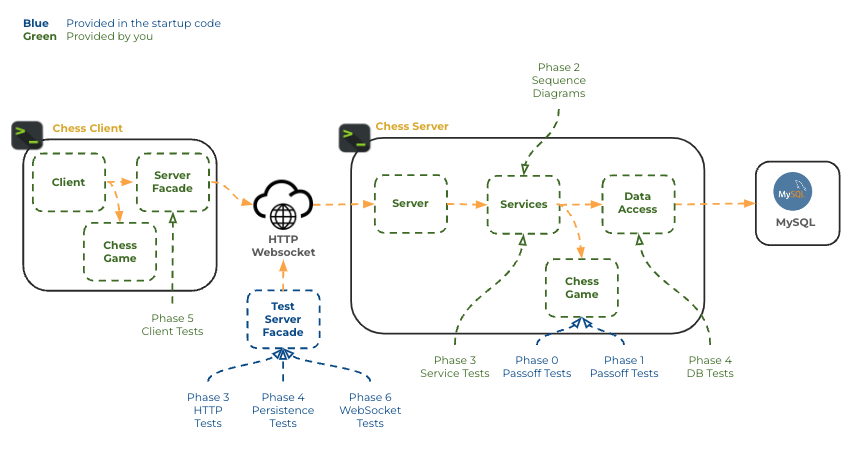
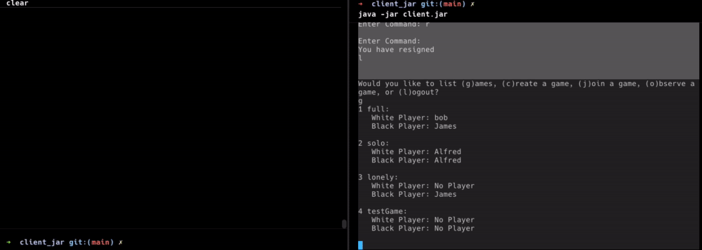

# Chess


We use the game of chess to help you develop and demonstrate mastery during this course. Your development work is divided into different phases. Each phase demonstrates a different architectural concept or technology.

| Phase            | Getting Started                           | Requirements                            | Starter Code                        | Description                                                    |
| ---------------- | ----------------------------------------- | --------------------------------------- | ----------------------------------- | -------------------------------------------------------------- |
| 0. Chess moves   | [doc](0-chess-moves/getting-started.md)   | [doc](0-chess-moves/chess-moves.md)     | [dir](0-chess-moves/starter-code)   | Initial chess project.                                         |
| 1. Chess game    | [doc](1-chess-game/getting-started.md)    | [doc](1-chess-game/chess-game.md)       | [dir](1-chess-game/starter-code)    | Creating the game.                                             |
| 2. Server design | [doc](2-server-design/getting-started.md) | [doc](2-server-design/server-design.md) | [dir](2-server-design/starter-code) | Designing the chess server.                                    |
| 3. Web API       | [doc](3-web-api/getting-started.md)       | [doc](3-web-api/web-api.md)             | [dir](3-web-api/starter-code)       | Creating an HTTP chess server.                                 |
| 4. Database      | [doc](4-database/getting-started.md)      | [doc](4-database/database.md)           | [dir](4-database/starter-code)      | Persistently storing players, games, and authentication.       |
| 5. Pregame       | [doc](5-pregame/getting-started.md)       | [doc](5-pregame/pregame.md)             | [dir](5-pregame/starter-code)       | Creating an command line interface (CLI) for the chess client. |
| 6. Gameplay      | [doc](6-gameplay/getting-started.md)      | [doc](6-gameplay/gameplay.md)           | [dir](6-gameplay/starter-code)      | Implementing gameplay with multiple players.                   |

## Starter Code

⚠ Each phase of the project comes with `starter code`. In order to make it easy to copy the starter files to your personal project repository, you should clone the course repository to your development environment.

```sh
git clone https://github.com/softwareconstruction240/softwareconstruction.git

```

## GitHub Commits

Git is an essential software development tool. It allows you to quickly recover from mistakes, share your code with others, backup your code, and serve as a portfolio of your skills.

⚠ You are required to make multiple commits to your public Chess GitHub repository for each phase. Each commit should represent a minor milestone within a phase. For example, after passing each test you should commit your code.

Failure to properly document your efforts with your GitHub history may result in your assignment deliverables being rejected. So make sure you commit your changes consistently and often.

## Deliverables

| Phase            | Deliverables                                                                                                                                  |
| ---------------- | --------------------------------------------------------------------------------------------------------------------------------------------- |
| 0. Chess moves   | 1. Complete pass off tests for the chess board and moves code.                                                                                |
| 1. Chess game    | 1. Complete pass off tests for the chess game code.<br/>2. Optionally complete castling and en passant tests for extra credit.                |
| 2. Server design | 1. Create javadocs for the service and database components.                                                                                   |
| 3. Web API       | 1. Complete pass off tests for the HTTP server<br/>2. Create and complete unit tests for chess service.                                       |
| 4. Database      | 1. Complete serialization pass off test.<br/>2. Create and complete unit tests for the chess database.                                        |
| 5. Pregame       | 1. Create and complete client unit tests.                                                                                                     |
| 6. Gameplay      | 1. Complete pass off tests for WebSocket server.<br/>2. Demonstrate that you can play a game of chess using your server and multiple clients. |

The deliverables in blue represent tests provided by the course start up code that you must pass. The deliverables in green represent unit tests that you must write and pass.



## Example

When you complete the entire project, you should have something similar to the following where two client command line programs take turns playing a game of chess.


