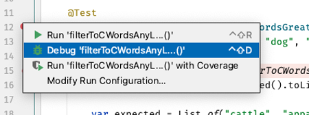
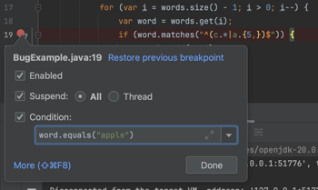

# Debugging

🖥️ [Slides](https://docs.google.com/presentation/d/14CiV7TwmAG-vEWWsQQtaP_-Hx-pqJlGR/edit?usp=sharing&ouid=114081115660452804792&rtpof=true&sd=true)

Debugging is one of the most important development skills that you can master. If you can learn how to rapidly reproduce a problem, narrow down its cause, and quickly implement a solution, you will dramatically increase your value as a software engineer.

Knowing what debugging tools are available and how to effectively employ them is key to your success. Common categories of debugging tools include:

1. Visual debuggers
1. Stack traces
1. Logs
1. Metrics
1. Customer reports
1. Development and staging environments
1. Unit, system, and end to end tests
1. Code reviews
1. Performance profilers

The more you think about debugging as applying the scientific method, the more you will become adept at the debugging process.

1. Concisely state the problem
1. Reproduce the problem with a unit test
1. Isolate a problem to its simplest representation
1. Step through the tested code
1. Implement a solution
1. Verify that the unit test passes
1. Verify that all tests pass

In this instruction we focus on `visual debuggers`. You are encouraged to become experts with the debugger that is available for your development environment. In our case this is IntelliJ. Learn how to quickly execute the debugger, use it with only keystrokes, maximize the use of breakpoints, inspect variables and execution stacks, and isolate a reproduction of the problem, possibly with new unit tests.

## Example Debugging

To demonstrate some debugging techniques let's consider a simple example of a function that has the following specification.

> Given a list of words, return a collection that only contains words of any length that start with a lower case `c`, and words that are longer than five characters that start with a lower case `a`.

With that description we go ahead an write our code and deploy it to production.

```java
Collection<String> filterToCWordsAnyLengthAndAWordsGreaterThanFive(List<String> words) {
    var result = new ArrayList<String>();
    try {
        for (var i = words.size(); i >= 0; i--) {
            var word = words.get(i);
            if (word.matches("^(c|a).{5,100}$")) {
                result.add(word);
            }
        }
    } catch (Exception ignore) {
    }
    return result;
}
```

Minutes later we get a report from a user that says when they try and use the function it doesn't return the expected result. When they pass in:

`"cattle", "dog", "appalachian", "apple", "pig"`

They are expecting to get back:

`"cattle", "appalachian"`

but instead they get back nothing.

## Reproducing the Bug with a Test

When you, or a customer, finds a bug, the first step is to verify the bug by creating a test that reproduces the problem. IntelliJ helps with this by providing the `Generate Test` functionality. So we right click on the function name and choose the `Generate` option followed by `Test...`.


This will write a stub test function.

```java
@Test
void filterToCWordsAnyLengthAndAWordsGreaterThanFive() {
}
```

We then fill in the test with the user's reported reproduction steps.

```java
@Test
void filterToCWordsAnyLengthAndAWordsGreaterThanFive() {
  var words = List.of("cattle", "dog", "appalachian", "apple", "pig");

  var actual = BugExample.filterToCWordsAnyLengthAndAWordsGreaterThanFive(words);
  actual = actual.stream().sorted().toList();

  var expected = List.of("cattle", "appalachian");
  expected.stream().sorted().toList();

  assertIterableEquals(expected, actual);
}
```

Now we can run the test and verify that we get the same result as what the customer reported.

```
org.opentest4j.AssertionFailedError: iterable lengths differ,
Expected :2
Actual   :0
```

## Stepping Through Code

Sometimes it is obvious what the problem is by simply looking at the test. Other times we need to step through the code using the debugger to see what is going on. To do this we put a breakpoint in our test on the line that makes the calling to our filtering function. You can set a breakpoint by click on the left margin.


With a breakpoint set, you can then click on the `debug` icon in the left margin associated with the function and select `Debug`. This will start up the test and execute until the breakpoint is reached.



At this point you can view the variables and confirm any assumptions that you have. This is an important step. Often times a bug is created when we make assumptions about the possible variable values. If everything looks good, then we can start stepping through the code.

### Hotkeys

An important skill to learn is the hotkeys for stepping through the code. Learning these keys will greatly increase you debugging speed. If you find yourself reaching for the mouse, take the time instead to learn the keystroke for the desired action. Each development environment is different, but here are the big ones for IntelliJ.

| Windows  | Mac   | Purpose           |
| -------- | ----- | ----------------- |
| Shift F9 | ⌃ D   | Debug             |
| F7       | F7    | Step into         |
| F8       | F8    | Step over         |
| F9       | ⌘ ⌥ R | Resume program    |
| Alt F9   | ⌥ F9  | Run to cursor     |
| Ctrl F8  | ⌘ F8  | Toggle breakpoint |

### Conditional Breakpoints

When you create a breakpoint in IntelliJ you can specify conditions such as the required value of a variable before the breakpoint will trigger. To set a conditional breakpoint, first set a breakpoint and then right click on it to bring of the conditions dialog.



## Examining up the Stack

As you are debugging you might find that you need to know what happened in the functions that called the current function that you are debugging. The chain of parent function calls is referred to as the `call stack`. You can tell the debugger to move the current context up the call stack so that you can see what the variable values were. To do this open, or move to, the debugger stake pane and click on the function you wish to inspect. When you are done looking up the stack, you can click on the current function and continue debugging.


## Executing Multiple Processes

Sometimes you need to debug/run multiple processes at the same time. For example, you might want to debug both your server and your client so that you can see how requests from the client execute on your server. With IntelliJ, you can debug multiple programs by just starting each one up individually. In the following image you can see that the server is started and a breakpoint set on the `listNames` HTTP endpoint. Then we set a breakpoint in the client and start it up. As the request flow goes from client to server, the server breakpoint is hit. Once we resume execution, the client picks up the when the call to the server returns. This allows us to see exactly what is happening in each application.


## Error Messages

The error messages generated while debugging often contain valuable information. Take that time to read them and digest what they are telling you. Also note that you can follow the links displayed in the stack traces to see exactly where the errors are occurring. You can then set a breakpoint on that line and rerun the test to debug what is going on.

```text
Exception in thread "main" java.lang.ArrayIndexOutOfBoundsException: Index 5 out of bounds for length 5
	at java.base/java.util.ImmutableCollections$ListN.get(ImmutableCollections.java:680)
	at debugging.BugExample.filter(BugExample.java:16)
	at debugging.BugExample.main(BugExample.java:9)
```

## Enhancing Tests

As you fix bugs you will often discover other problems that haven't been reported yet. For example, our specification says that you can have `a` words of length greater than five, but if we modify our test to try long `a` words we will discover that there is still a bug.

```java
@Test
void filterToCWordsAnyLengthAndAWordsGreaterThanFive() {
    var big = "a";
    for (var i = 0; i < 1005; i++) {
        big += 'a';
    }

    var words = List.of("cattle", "dog", "appalachian", "apple", "pig", big);
    var results = BugExample.filterToCWordsAnyLengthAndAWordsGreaterThanFive(words);
    results = results.stream().sorted().toList();

    var expected = List.of("cattle", "appalachian", big);
    expected = expected.stream().sorted().toList();
}
```

## Things to Understand

- How to set a breakpoint
- How to step through code and into method calls
- How to set conditional breakpoints
- How to view the values and local and instance values while stepping through code
- How to view the current call stack
- How to set watches

## Videos

- 🎥 [Introduction](https://byu.hosted.panopto.com/Panopto/Pages/Viewer.aspx?id=f2279dc0-fd71-46af-ab7a-ad6d01516f20&start=68.656585)
- 🎥 [Debugging in IntelliJ](https://byu.hosted.panopto.com/Panopto/Pages/Viewer.aspx?id=6ff3df28-71f9-435e-915e-ad6d01535f13&start=253.821601)
