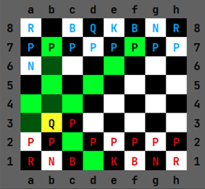

# Introduction

🖥️ [Slides](https://docs.google.com/presentation/d/1hn9IpJT1DMQ1fECSt1CY7EdoDi4OQgRn/edit?usp=sharing&ouid=114081115660452804792&rtpof=true&sd=true)

Welcome to Computer Science 240: `Advanced Software Construction`. This course focuses on learning how professional software developers build applications. As part of this instruction you will gain experience with the skills and technologies used in the real world of software construction. This includes: Software design, data modeling, object oriented programming, distributed communication, relational databases, and testing.

In previous courses you have probably focused on building small programs that targeted learning a particular concept. While these programs teach you a specific concept, they fail to provide you with the skills necessary to create applications that require careful design, engineering, and tooling.

## Projects

There are two programming projects that you will complete for this course. The first program is a simple `spelling corrector`. This program takes as input, a dictionary and a candidate word. The corrector analyzes the word and then returns a corrected suggestion.

```sh
➜  java spell dictionary.txt truble

Suggestion: trouble
```

The purpose of the spelling corrector is to help you learn the basics of your development tools. After you have completed the spelling corrector you will take a timed exam during which, you will reimplement the program without referencing your previous work. Being able to efficiently write code under a deadline will demonstrate your mastery, and prepare you for the realities of programming professionally.

Once you have completed the spelling corrector, you can confidently assume that you have the basic skills necessary to complete the second, and much larger, `multi-player chess` program. This program consists of a chess server that allows multiple client player programs to connect, register users, and play games.



The chess program is broken up into [six different phases](../../chess/chess.md). Each phase teaches a different concept related to the construction of a large programming project. Once you have completed the final phase, you will have created a fully functional application that you can use to play chess with your friends.

## Java

You will use the Java programming language for all of your work in this course. Java has been a popular language for multiple decades. According to the [2023 Stack Overflow survey](https://survey.stackoverflow.co/2023/#most-popular-technologies-language-prof), Java is used by 30% of professional developers. Java has some nice properties. It is object oriented, compiled, has garbage collection, and is strongly typed. In short, Java is a good language to help you round out your skill set and resume.


In order to properly learn Java, you will need to reference selected chapters of the book `Core Java for the Impatient`. This book is available for free on the Safari Books collection available through the Harold B. Lee Library. You can also reference the many resources available on the web for mastering the different concepts found in the Java programming languages.


⚠ Note that it is critical that you reserve a significant amount of your time to learn Java outside of class. In class we focus on concepts that are needed for the projects, hard concepts, and things that tend to confuse students. It is assumed that you already learned the basics of Java on your own.

## Enrichment Lectures

Towards the end of the course, while you are hammering away on your chess program, the course topics will focus on additional enrichment material that you should be familiar with as a professional developer. These topics will not be reflected in your project work, but you will need to be familiar with their content since they will represent the bulk of the material covered by the final exam. These includes topics such as security, concurrency, and Java command line tools.

## Canvas

All of the course instruction is represented on GitHub, however we use Canvas to send out notifications, submit your projects, take exams, and view your grades.


⚠ Make sure you have enabled Canvas to send notifications to an email account that you monitor regularly. Failure to do this will mean that you miss important notifications that could impact your efforts and grade.

## Well Rounded Software Engineers

The key to learning how to be an exceptional software engineer rests in your ability to continually improve in four areas.


1. **`Technology`** - You need to know the technology. The better you know it the better you will be able to leverage its abilities and apply it correctly. Knowing who the experts are, and discerning between meaningful technology and fads, driven by marketeers, allows you quickly find the valuable and avoid the distractions. Knowing technology will enable you to find the right tool for the job, maximize its performance, and automate its execution.
1. **`Art`** - Making a visually attractive application requires artistic skills. However, there is just as much art in making them usable, efficient, and maintainable. Knowing how to organize and sculpt your code is incredibly artistic. Well designed systems are often referred to as beautiful or elegant, and a reflection of the creativity of their authors.
1. **`Social`** - Web applications are rarely created and used by one person. Usually you build an application for a large group of customers, and they almost always are created by a team of contributors with different backgrounds and roles. The ability for that team to work together and interact with customers is essential. These are social skills. The more skilled you are at talking, writing, reading, presenting, expressing body language, projecting a good appearance, and most importantly, listening, the more successful you will be.
1. **`Discovery`** - Having a mind that is always questioning will make all the difference. Simply doing the job is not enough. Wanting to know why the job is useful, searching for alternative directions, digging into the inner workings of a black box, and questioning accepted facts are all where progress is made. Cultivating a love for life long learning will take you from adequate to exceptional.

> “When hiring we look for the ability to collaborate, creativity, curiosity, and expertise”
>
> — Tim Cook, ([source](https://appleinsider.com/articles/22/10/03/if-you-want-to-work-for-apple-you-need-these-four-traits))

## Mastery Demonstration

Your mastery of advanced software construction is demonstrated by the following three areas and percentages.

| Area               | Percentage |
| ------------------ | ---------- |
| Spelling Corrector | 5%         |
| Chess              | 75%        |
| Exams              | 20%        |

More importantly than the actual grade you receive from this course is the degree to which you stretch yourself. Software construction is an area that takes decades of effort to master. If you approach this subject matter intentionally, with effort and curiosity, you will find your value as a software engineer greatly increased.

Take the time during the course to dive deeper into topics that you find interesting. Learn from external sources and gain a wide perspective of understanding. Question what is being taught and seek to find a better way to construct software. With this attitude, **you** might be the next leader of a new revolution in software construction.
