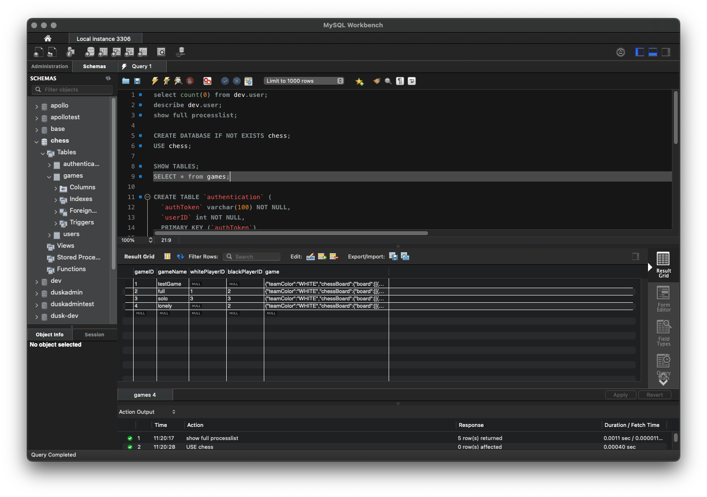

# MySQL

🖥️ [Slides](https://docs.google.com/presentation/d/1w5bcntrExgMnB92uLJL52uuutLLQABSt/edit?usp=sharing&ouid=114081115660452804792&rtpof=true&sd=true)

`MySQL` is an open source relational database that commonly powers many popular applications and websites. Learning how MySQL works will help you understand the relational data model, give you experience with an industry standard tool, and teach you |how to use it to power your applications.

## SQL Server Installation

In order to get started you will need to install MySQL to your development environment. You can install the latest free MySQL Community Server version from [MySQL.com](https://dev.mysql.com/downloads/mysql/).

## Clients

Once you have install MySQL it is time to start executing SQL statements. To do this you need a SQL client application that can talk to the SQL server that is now running in your development environment.

There are several free and paid for options that you can choose from when looking for a client application to execute MySQL statements. By default, when you installed the MySQL server it should have also installed a console client program called the MySQl Shell (`mysqlsh`). To start the shell, open a command console window and type the following (substituting the username and password that you provided when you installed MySQL).

```sh
mysqlsh -u yourusername -pyourpassword --sql
```

Once the shell starts up you can get help by typing `/help` or exit the shell using `/exit`. You can now start typing SQL queries. For example, try the following:

```sql
SHOW databases;
USE mysql;
SHOW tables;
SELECT host, user FROM user;
/exit
```

Alternatively, if you are looking for a visual MySQL client you might try [MySQL workbench](https://www.mysql.com/products/workbench/).



## Common Commands

Here are a list of common SQL commands that you can use to administrate a database.

| Command                | Purpose                                                     | Example                                       |
| ---------------------- | ----------------------------------------------------------- | --------------------------------------------- |
| show databases         | Lists all of the databases                                  | show databases                                |
| use `name`             | Open database                                               | use student                                   |
| show tables            | Lists all of the tables for the currently selected database | show tables                                   |
| describe `name`        | List fields for a table                                     | describe student                              |
| show index from `name` | List indexes for a table                                    | show index from student                       |
| show full processlist  | List currently executing queries                            | show full processlist                         |
| create database `name` | Create a new database                                       | create database student                       |
| drop database `name`   | Delete a database                                           | drop database student                         |
| create table `name`    | Create a new table                                          | create table pet (name varchar(128), age int) |
| Insert into `name`     | Insert data into a table                                    | insert into pet values ("zoe", 3)             |
| select \_ from `name`  | Query a table                                               | select \_ from pet                            |
| drop table `name`      | Delete a table                                              | drop table pet                                |
