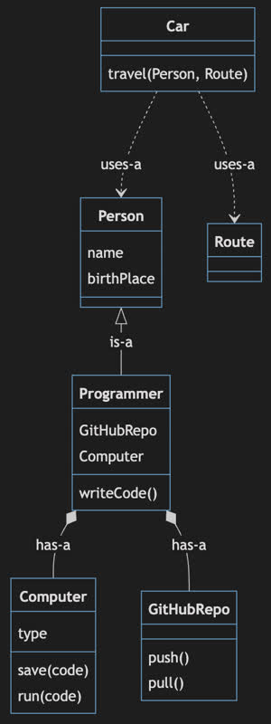
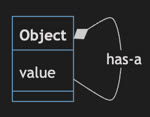

# Object Oriented Design

🖥️ [Slides](https://docs.google.com/presentation/d/17S-Y7Og08S9kRWHZfnH8k2wTBht39aCd/edit?usp=sharing&ouid=114081115660452804792&rtpof=true&sd=true)

`Object Oriented` design focuses on describing objects in the application domain as literal programming constructs. That means if your application contains people who eat fruit. Then you model the application by creating a `Person` and `Fruit` object. Those objects will have properties such as name, ripeness, and color. The objects will also have operations such as eat, plant, grow, or purchase. You then write your code as real world interactions between the core application domain objects. To continue our example, you would have interactions where a `Person` will either `plant`, or `purchase`, a `Fruit` object and then `eat` the fruit.

> Eating fruit sequence diagram

Object oriented design owes much of its popularity to its natural representation of the real world. By carefully modeling the actual application domain, the resulting code will exclude complications that would have resulted if you use other [programming paradigms](https://en.wikipedia.org/wiki/Programming_paradigm) that focus more on functional logic or declarative constructs.

In object oriented programming everything revolves around a `Class` construct that serves as the template for actual objects. Classes always represent nouns, or things, such as a cat, car, word, database row, or even abstract things such as a thought or behavior. A class's operations, or methods, are always verbs, such as build, run, speak, compute, or destroy. When you instantiate a class into an object, you convert the template into an actual thing. For example, we can create an object named `James` from a class named `Person`. The class `Person` has a `birthPlace` field, the object `James` has a birth place value of Alberta Calgary.

| Real World                       | Class Representation               | Object Representation |
| -------------------------------- | ---------------------------------- | --------------------- |
|  |  | James, Alberta        |

> _Source: Wikipedia_

## Object Relationships

In order to fully model the real world with your objects, you need to describe the relationships between objects. Three of the most common relationships are `is-a`, `has-a`, and `uses-a`.

| Relationship | Description                                                             | Example                            |
| ------------ | ----------------------------------------------------------------------- | ---------------------------------- |
| Is-A         | Polymorphic inheritance. This defines what something is, or appears as. | A `Programmer` is a `Person`.      |
| Has-A        | Ownership.                                                              | A `Programmer` has a `Computer`    |
| Uses-A       | Transient association. This is often associated with an operation.      | A `Person` uses a `Car` to travel. |

The following is an example of the relationships between a number of objects. Note that there are many ways that you can represent the real world with object oriented design.

The key is to understand your domain and distill the important object fields, operations, and interactions down to the minimal representation that meets the application needs. That might mean that your model doesn't perfectly fit real world objects, but you can often make your model easier to use and understand if you skip some of the important details. Likewise, sometimes the most literal domain representation does not fit the model of how users interact with their domain. When that happens, go with the users. It is their mental model you are trying to represent.

For example, in the above example, a `Programmer` doesn't actually have a single `Computer` that is part of the required definition of a programmer. A more real world representation would be to allow for multiple computers, or to have a `uses-a` relationship with the computer instead of a `has-a` relationship. However, if our application doesn't need that complexity, then you can simplify things by making the assumption that all programmers in our domain have a single computer that they use to write code with. That allows you to encapsulate, or hide, the computer and gitHub repo they are using when the `writeCode` method is called.

What you really want to avoid is missing key objects, representing multiple objects with a single object, or providing unnecessary detailed complexity that obscures the vital mental model of the user.

In short, someone who understands the domain and the users of the application, should be able to review your model, and not be surprised by what objects you chose and how they relate to each other.

## Encapsulation

A good object oriented design will be easy to enhance or improve as time goes by. Encapsulation, or hiding details that doesn't need to be shared, makes it easier to enhance your model as the application requirements evolve. For example, in the above model we encapsulated the `Computer` object into the `Programmer` object. When you call `writeCode` it just uses the encapsulated functionality of the `Computer`.

We can always add functionality later that exposes that a `Programmer` has a computer, or pass the computer as part of the `writeCode` call, but if we keep that hidden then we are free to change the relationship with the computer and the programmer until it is necessary to expose it.

In many ways encapsulation is preferable to inheriting functionality primarily because to is more extensible. This is primarily due to the fact that there is no immediate external exposure of the encapsulation. With inheritance (using `extends` for your object) you are explicitly, publicly, exposing both the methods and the implementation that the extended class provides.

## Simplicity

Simplicity is another important characteristic of object oriented programming. One form of simplicity is restricting the number of objects in your system to the smallest number possible. This includes the number of interfaces you create, how inheritance is abstracted, and what operations an object exposes.

Of course you can simplify too far and end up with thousands of classes that each have a single line of code, or a single object that aggregates itself and can represent everything. Both of these extremes should be avoided. What you want is to be straight forward in your object modeling and try to stick as close to the real world domain as possible.

#################################
#################################
#################################
#################################

Example of too many classes

#################################
#################################
#################################
#################################

## Things to Understand

- First understand the application domain
- Domain represented with classes
- Classes are nouns that represent real world objects
- Classes have methods and properties just like real world objects
- Classes have relationships to each other. Is-A, Has-A, Uses-A
- You encapsulate data in order to hide implementation details
- Single Responsibility Principle
- Class diagram
- Sequence diagram

## Videos

- 🎥 [Object-Oriented Design Overview](https://byu.hosted.panopto.com/Panopto/Pages/Viewer.aspx?id=77c184e5-8afd-4c56-84c8-ad64013f7a4b&start=0)
