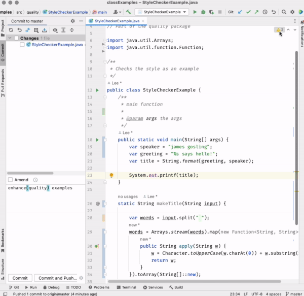

# Style Checking

🖥️ [Slides](https://docs.google.com/presentation/d/1xy5WXrwQuZLEOtAX7W9B9ZgICc047wQz/edit?usp=sharing&ouid=114081115660452804792&rtpof=true&sd=true)

Adhering to best practices and being consistent in your code structure, styles, and formatting is a hallmark of a professional developer. Historically, a proficient development team, would develop a document that outlined the standards that the team was expected to adhere to. This included common idioms to follow, anti-patterns to avoid, and a description of proper formatting and coding layout. As an example, you can reference [Google's style guide for Java](https://google.github.io/styleguide/javaguide.html). You will see that it describes very basic things like how you indent your code, how your order your import statements, and a limit on line length.

Style guides are usually very opinionated. This is because they are attempting to create a common representation of code that enables the team to focus on what the code does, and not what the code looks like. Being willing to put the team first is an important part of what is called [Egoless Development](https://blog.codinghorror.com/the-ten-commandments-of-egoless-programming/), and should be a quality that you strive to refine as part of your professional development.

One of the easiest ways to drop the ego, and conform to the team, is to simply use automated tools for organizing, formatting, and styling your code. Modern programming languages such as `Go` and `Rust` actually deploy linters and formatters as part of their language toolkit. This makes it so that any code written in that language, is formatted in a similar way. `Python` takes it a step further and actually makes the formatting part of the language.

When using IntelliJ, there is a built in action to reformat your code when you save a file. You can also enable a style checker that runs before you push your code to GitHub. Tools like this also help you discover features of Java that you might not be familiar with.

You can either use the keystroke to format the current file, or you can enable automatic formatting in IntelliJ so that it formats a file when it is saved. The following video show the use of both formatting methods.

To have IntelliJ check your files for idiomatic problems and suggest ways to clean up your code, you can invoke the `Problem` checker or click on the yellow light bulbs when then appear next to your code. Also note that when you push your code to GitHub it will automatically run the `Problem` checker before it completes the push.

It is important to use these tools while you are developing your code. Otherwise, you end up with hundreds of problems that need to be corrected and the temptation is to then ignore them all. These tools often discover real problems with your code, and so don't ignore them.
